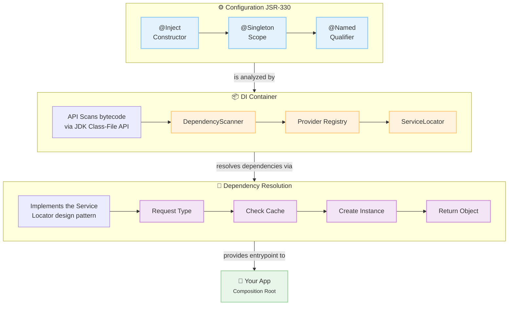

# Dimension-DI

Tiny, fast, zero-boilerplate runtime Dependency Injection (DI) framework for Java.

## Contents

- [Why Dimension-DI?](#why-dimension-di)
- [Core Philosophy](#core-philosophy)
- [Requirements](#requirements)
- [Installation](#installation)
- [Usage](#usage)
    - [1. Define Your Components](#1-define-your-components)
    - [2. Configure and Initialize](#2-configure-and-initialize)
      - [ Field Injection (Optional)](#field-injection-optional)
    - [Binding Interfaces and Named Implementations](#binding-interfaces-and-named-implementations)
    - [Named implementations via @Named](#named-implementations-via-named)
    - [Custom Providers (like @Provides)](#custom-providers-like-provides)
    - [Skipping Scanning (Manual Wiring Only)](#skipping-scanning-manual-wiring-only)
    - [Testing and Overriding](#testing-and-overriding)
- [How It Works](#how-it-works)
    - [DependencyScanner](#dependencyscanner)
    - [DimensionDI.Builder](#dimensiondibuilder)
    - [ServiceLocator](#servicelocator)
- [Design Notes: DI vs Service Locator](#design-notes-di-vs-service-locator)
- [Limitations](#limitations)
- [API Cheatsheet](#api-cheatsheet)
    - [Bootstrap](#bootstrap)
    - [Runtime Fetch (Composition Root Only)](#runtime-fetch-composition-root-only)
    - [Manual Registration (on Builder)](#manual-registration-on-builder)
    - [Utilities](#utilities)
- [Comparison Tables](#comparison-tables)
- [Documentation](#documentation)
- [DI Containers Comparison](#di-containers-comparison)
- [Notice](#notice)
- [Contact](#contact)

This framework provides dependency injection (DI) based on JSR-330 (jakarta.inject.*) annotations. It automatically discovers and wires your application's components through constructor injection, leveraging classpath scanning near a zero-configuration setup. Designed for simplicity and fast startup, it's perfect for smaller applications, microservices, and tools that need the benefits of DI without the overhead associated with larger frameworks like Spring, Guice, and Dagger 2.


<details>
  <summary>Mermaid schema</summary>


</details>

## Why Dimension-DI?

Dimension-DI is a lightweight, runtime-oriented dependency injection container designed for simplicity and performance. It delivers the essential features you need without the complexity:

- **Standards-Based:** Uses JSR-330 (@Inject, @Named) for clean, constructor-injected code.
- **Powerful & Safe:** Features @Singleton scoping, circular dependency detection, and explicit binding for interfaces.
- **Fast & Efficient:** Employs classpath scanning via the JDK Class-File API (without loading classes) for rapid startup, working seamlessly from both directories and JARs.
- **Minimal Overhead**: No proxies, bytecode generation, or runtime magic—just a simple, thread-safe service locator under the hood that you'll never need to touch in your business logic.

## Core Philosophy

Dimension-DI follows a two-phase approach:

1.  **Build-Time Configuration:** A fluent `Builder` API is used to configure the DI container. This phase involves scanning the classpath for components marked with `@Inject`, analyzing their dependencies, and registering providers (recipes for creating objects). This is where the "DI" part shines.
2.  **Runtime Resolution:** At runtime, dependencies are resolved using an internal, globally accessible `ServiceLocator`. While the implementation uses a Service Locator, the design encourages you to write your application code using pure **Constructor Injection**, decoupling your components from the DI framework itself.

## Requirements

- Java 25+ with JDK Class-File API.

## Installation

To use Dimension-DI in your Maven project, add the following dependency to your `pom.xml`:

```XML
<dependency>
  <groupId>ru.dimension</groupId>
  <artifactId>di</artifactId>
  <version>${revision}</version>
</dependency>
```

## Usage

### 1. Define Your Components

Create your services and components using standard `jakarta.inject.*` annotations. Your classes should not have any knowledge of Dimension-DI.

```Java
import jakarta.inject.Inject;
import jakarta.inject.Singleton;

@Singleton
class Config {
  String url() { return "https://api.example.com"; }
}

class ApiClient {
  private final Config config;

  @Inject
  ApiClient(Config config) {
    this.config = config;
  }
}

class App {
  private final ApiClient api;

  @Inject
  App(ApiClient api) {
    this.api = api;
  }

  void run() {}
}
``` 

### 2. Configure and Initialize

Scan your base packages and get entry point from ServiceLocator

```Java
import ru.dimension.di.DimensionDI;
import ru.dimension.di.ServiceLocator;

public class Main {
  public static void main(String[] args) {
    DimensionDI.builder()
        .scanPackages("com.example")
        .buildAndInit();

    App app = ServiceLocator.get(App.class);
    app.run();
  }
}
``` 

All dependencies are resolved via constructor injection. @Singleton classes are cached.

##### Field Injection (Optional)

While constructor injection is recommended, Dimension-DI also supports field injection for flexibility:

```Java
import jakarta.inject.Inject;
import jakarta.inject.Named;

class NotificationService {
  @Inject private EmailSender emailSender;

  @Inject @Named("sms")
  private MessageSender smsSender;

  public void notify(User user, String message) {
    emailSender.send(user.getEmail(), message);
  }
}
``` 

Note: Field injection occurs after construction. Final fields cannot be injected.

### Binding Interfaces and Named Implementations

When injecting interfaces, add a binding so the container knows which implementation to use.

```Java
import jakarta.inject.Inject;

interface Transport { }

class HttpTransport implements Transport {
  @Inject HttpTransport(Config cfg) { }
}

class Service {
  @Inject Service(Transport transport) { }
}
``` 

Bind interface to implementation

```Java
import ru.dimension.di.DimensionDI;

public class Main {
  public static void main(String[] args) {
    DimensionDI.builder()
        .scanPackages("com.example")
        .bind(Transport.class, HttpTransport.class)
        .buildAndInit();
  }
}
``` 

###  Named implementations via @Named

```Java
import jakarta.inject.Inject;
import jakarta.inject.Named;

interface Cache {}
class RedisCache implements Cache { @Inject RedisCache(Config c) { } }
class InMemoryCache implements Cache { @Inject InMemoryCache() { } }

class Repository {
  @Inject Repository(@Named("fast") Cache cache) { }
}
```

```Java
import ru.dimension.di.DimensionDI;

public class Main {
  public static void main(String[] args) {
    DimensionDI.builder()
        .scanPackages("com.example")
        .bindNamed(Cache.class, "fast", InMemoryCache.class)
        .bindNamed(Cache.class, "durable", RedisCache.class)
        .buildAndInit();
  }
}
``` 

### Custom Providers (like @Provides)

For objects that need custom construction logic (heavy init, load from file/env, etc)

```Java
import ru.dimension.di.DimensionDI;

public class Main {
  public static void main(String[] args) {
    DimensionDI.builder()
        .scanPackages("com.example")
        .provide(Config.class, ServiceLocator.singleton(() -> {
          { }
          return new Config();
        }))
        .buildAndInit();
  }
}
```

Use `ServiceLocator.singleton(supplier)` to cache the result.

```Java
import ru.dimension.di.DimensionDI;

public class Main {
  public static void main(String[] args) {
    DimensionDI.builder()
        .scanPackages("com.example")
        .provideNamed(Cache.class, "fast", ServiceLocator.singleton(InMemoryCache::new))
        .buildAndInit();
  }
}
```

### Skipping Scanning (Manual Wiring Only)

If you cannot or do not want to use the Class-File API

```Java
import ru.dimension.di.DimensionDI;
import ru.dimension.di.ServiceLocator;

public class Main {
  public static void main(String[] args) {
    DimensionDI.builder()
        .provide(Config.class, ServiceLocator.singleton(Config::new))
        .provide(ApiClient.class, () -> new ApiClient(ServiceLocator.get(Config.class)))
        .provide(App.class, () -> new App(ServiceLocator.get(ApiClient.class)))
        .buildAndInit();
  }
}
```

### Testing and Overriding

Swap implementations in tests without changing source

```Java
import ru.dimension.di.DimensionDI;
import ru.dimension.di.ServiceLocator;

class FakeApiClient extends ApiClient { }

void setupTest() {
  DimensionDI.builder()
      .scanPackages("com.example")
      .provide(ApiClient.class, FakeApiClient::new)
      .buildAndInit();
}
```

Override at runtime

```Java
@Test
void runTest() {
  ServiceLocator.override(ServiceLocator.Key.of(ApiClient.class), FakeApiClient::new);
}
```

Reset

```Java
@Test
void runTest() {
  ServiceLocator.clear();
}
```

## How It Works

### DependencyScanner

- Scans configured packages for concrete classes with:
    - an `@Inject` constructor, **or**
    - a public no-arg constructor
- Reads `@Singleton` and implemented interfaces
- Uses the JDK Class-File API to inspect bytecode without loading classes

### DimensionDI.Builder

- Builds a provider map from scanned results
- Adds manual `bind` and `provide` entries (manual overrides win)
- Initializes the ServiceLocator with providers

### ServiceLocator

- Thread-safe registry of `Key -> Supplier<?>`
- Resolves constructor parameters on-demand (supports `@Named`)
- Performs field injection after construction (supports `@Inject` on fields, including `@Named` qualifiers)
- Detects circular dependencies and throws with a helpful stack
- Caches singletons via `SingletonSupplier`

**Note**: Providers are keyed by concrete classes by default. Interfaces require explicit `bind` or `bindNamed`.

---

## Design Notes: DI vs Service Locator

- You write normal constructor-injected code with `@Inject`. This is DI-friendly.
- Internally, the container uses a simple service locator `ServiceLocator` for resolution.
- **Best practice**: only call `ServiceLocator.get(...)` at the composition root (for example, to get your top-level `App`).

---

## Limitations

- Only Jakarta Inject annotations are supported:
  - `@Inject` (on constructors and fields)
  - `@Singleton`
  - `@Named` (on constructor parameters and fields)
- Field injection works on `private`, `protected`, and `public` non-final fields, including inherited ones.
- **Not yet supported**:
  - Method injection
  - Custom qualifiers beyond `@Named`
  - Assisted injection, `Provider<T>`, multi-bindings (collections), scopes beyond singleton
- Scanning uses the JDK Class-File API.

---

## API Cheatsheet

### Bootstrap
- `DimensionDI.builder().scanPackages(...).bind(...).provide(...).buildAndInit();`

### Runtime Fetch (Composition Root Only)
- `ServiceLocator.get(MyRoot.class)`

### Manual Registration (on Builder)
- `.provide(type, supplier)`
- `.provideNamed(type, name, supplier)`
- `.bind(interface, impl)`
- `.bindNamed(interface, name, impl)`

### Utilities
- `ServiceLocator.singleton(supplier)` — Caches an instance.
- `ServiceLocator.override(key, supplier)` — Replaces a provider at runtime.
- `ServiceLocator.alias(aliasKey, targetKey)` — Creates an alias for a provider.
- `ServiceLocator.clear()` — Resets the entire registry.

## Comparison Tables

### Table 1. Dimension-DI vs Big Three

| Feature                       | Dimension-DI                           | Spring IoC                             | Google Guice               | Dagger 2                  |
|-------------------------------|----------------------------------------|----------------------------------------|----------------------------|---------------------------|
| Annotation Standard           | JSR-330 (Jakarta)                      | Spring-specific + JSR-330              | JSR-330                    | JSR-330 + custom          |
| Dependency Injection          | Constructor, Field                     | Constructor, field, method             | Constructor, field, method | Constructor-based         |
| Learning Curve                | ⭐ Minimal                              | ⭐⭐⭐⭐⭐ Steep                            | ⭐⭐⭐ Moderate               | ⭐⭐⭐ Moderate              |
| Performance                   | ⭐⭐⭐⭐⭐ Very High                        | ⭐⭐ Slow                                | ⭐⭐⭐ Medium                 | ⭐⭐⭐⭐⭐ Fastest             |
| Startup Time                  | Ultra-fast                             | Slow                                   | Fast                       | Instant (compile-time)    |
| Runtime metadata              | JDK Class-File API                     | Dynamic reflection                     | Dynamic reflection         | None (compile-time)       |
| Bytecode Generation           | None                                   | Extensive proxies                      | Extensive proxies          | Compile-time only         |
| Scoping                       | @Singleton                             | Request, Session, Singleton, Prototype | Singleton, custom          | Singleton, custom         |
| @Singleton Support            | ✅ Yes                                  | ✅ Yes                                  | ✅ Yes                      | ✅ Yes                     |
| @Named Qualifiers             | ✅ Yes                                  | ✅ Yes                                  | ✅ Yes                      | ✅ Yes                     |
| Custom Providers              | ✅ `provide()`                          | ✅ `@Bean`                              | ✅ `@Provides`              | ✅ `@Provides`             |
| Field Injection               | ✅ Yes                                  | ✅ Yes                                  | ✅ Yes                      | ✅ Yes (members injection) |
| Method Injection              | ❌ No                                   | ✅ Yes                                  | ✅ Yes                      | ✅ Yes (members injection) |
| Collections/Multi-bind        | ❌ No                                   | ✅ Yes                                  | ✅ Yes                      | ✅ Yes (@IntoSet/@IntoMap) |
| Circular Dependency Detection | ✅ Yes, explicit                        | ✅ Yes                                  | ✅ Yes                      | ✅ Compile-time            |
| Module/Config System          | Fluent Builder                         | `@Configuration` + XML                 | `Module` classes           | `Component` interface     |
| Testing Support               | ✅ Override, Clear                      | ✅ Profiles, Mocks                      | ✅ Binding override         | ✅ Test components         |
| JAR/Directory Scanning        | ✅ Both                                 | ✅ Both                                 | Manual by default          | N/A (compile-time)        |
| Framework Size                | ~19KB                                  | ~10MB+                                 | ~782Kb                     | ~47Kb                     |
| Best For                      | Microservices, Tools, Minimal overhead | Enterprise apps, full web stack        | Medium projects, modular   | Android, compile-safety   |
| Zero Configuration            | ✅ Full classpath scan                  | ⚠️ Needs setup                         | Manual registration        | Compile-time setup        |

---

### Table 2. Dimension-DI vs Alternative Lightweight Containers

| Feature                       | Dimension-DI                | PicoContainer            | HK2                        | Avaje Inject             |
|-------------------------------|-----------------------------|--------------------------|----------------------------|--------------------------|
| Annotation Standard           | JSR-330                     | Custom only              | JSR-330                    | JSR-330                  |
| Lightweight                   | ✅ Ultra-light               | ✅ Very light             | ⚠️ Moderate                | ✅ Light                  |
| Classpath Scanning            | ✅ Class-File API            | ❌ Manual only            | ✅ Yes                      | ✅ Yes                    |
| Constructor Injection         | ✅ Yes                       | ✅ Yes                    | ✅ Yes                      | ✅ Yes                    |
| Field Injection               | ✅ Yes                       | ✅ Yes                    | ✅ Yes                      | ✅ Yes                    |
| Scoping                       | @Singleton                  | Singleton                | Singleton, request, custom | Singleton, custom        |
| @Named Qualifiers             | ✅ Yes                       | ❌ No                     | ✅ Yes                      | ✅ Yes                    |
| Custom Providers              | ✅ `provide()`               | ✅ Manual factories       | ✅ `@Factory`               | ✅ `@Factory`             |
| Circular Dependency Detection | ✅ Explicit error            | ❌ Runtime error          | ✅ Yes                      | ✅ Yes                    |
| Performance                   | ⭐⭐⭐⭐⭐                       | ⭐⭐⭐⭐                     | ⭐⭐⭐                        | ⭐⭐⭐⭐⭐                    |
| Startup Time                  | Ultra-fast                  | Very fast                | Fast                       | Fastest (compile-time)   |
| Runtime Reflection            | Minimal                     | Extensive                | Moderate                   | None (compile-time)      |
| Service Locator Pattern       | ✅ Internal only             | ✅ Primary model          | ✅ HK2ServiceLocator        | ✅ Internal only          |
| Compilation Model             | Runtime scan                | Manual registration      | Runtime scan               | Compile-time (APT)       |
| Maven Integration             | ✅ Easy                      | ✅ Easy                   | ✅ Easy (Jersey)            | ✅ Easy (APT)             |
| Testing Support               | ✅ Override, Clear           | ✅ Rebind                 | ✅ Yes                      | ✅ Yes                    |
| Framework Size                | ~19KB                       | ~327KB                   | ~131Kb                     | ~80KB                    |
| Active Development            | ✅ Modern                    | ⚠️ Dormant               | ✅ Active                   | ✅ Active                 |
| Jakarta Inject Ready          | ✅ Full                      | ⚠️ Partial               | ✅ Yes                      | ✅ Yes                    |
| Best For                      | Microservices, fast startup | Embedded, custom, legacy | OSGi, modular systems      | Compile-safe DI, GraalVM |
| Java Version                  | 25+                         | 8+                       | 8+                         | 11+                      |

---

## DI Containers Comparison

Using source code of [DI Containers Comparison](https://github.com/Heapy/di-comparison) project.

### Test environment
```
Processor: AMD Ryzen 5 5600H with Radeon Graphics, 3301 Mhz, 6 Core(s), 12 Logical Processor(s)
Memory: 16.0 GB
Disk: Generic Flash Disk USB Device<br>- SAMSUNG MZVL2512HCJQ-00B00 (476.94 GB) 
OS: Microsoft Windows 11 (WSL2)

java version "25.0.1" 2025-10-21 LTS
Java(TM) SE Runtime Environment (build 25.0.1+8-LTS-27)
Java HotSpot(TM) 64-Bit Server VM (build 25.0.1+8-LTS-27, mixed mode, sharing)
```

### Table 3. Results for JVM
| DI  | Jar w/Deps Size, Mb | ⬇️ Wall, ms | User, ms | Sys, ms | Max RSS, Mb | Allocated, Mb | Alloc Count | LoC |
|-----|---------------------|-------------|----------|---------|-------------|---------------|-------------|-----|
| jvm | 1.75                | 79.30       | 23.20    | 18.40   | 41.38       | 0.25          | 6           | 2   |

### Table 4. Results for 2 classes
| DI                   | Jar w/Deps Size, Mb | ⬇️ Wall, ms   | User, ms      | Sys, ms      | Max RSS, Mb  | Allocated, Mb | Alloc Count | LoC       |
|----------------------|---------------------|---------------|---------------|--------------|--------------|---------------|-------------|-----------|
| baseline             | 1.75                | 100.30        | 47.00         | 22.10        | 43.54        | 0.25          | 6           | 24        |
| kotlin-lazy          | 1.75                | 101.70        | 53.30         | 20.90        | 43.73        | 0.25          | 7           | 31        |
| dagger               | 1.82                | 157.40        | 59.80         | 27.40        | 43.73        | 0.26          | 8           | 51        |
| cayennedi            | 1.82                | 160.50        | 119.00        | 30.60        | 51.27        | 0.25          | 8           | 49        |
| <b>dimension</b>     | <b>1.78</b>         | <b>178.70</b> | <b>136.50</b> | <b>35.90</b> | <b>54.57</b> | <b>0.28</b>   | <b>12</b>   | <b>37</b> |
| kodein               | 3.43                | 248.30        | 173.10        | 42.70        | 53.92        | 2.41          | 33          | 32        |
| koin                 | 2.22                | 283.90        | 180.90        | 49.80        | 58.18        | 2.15          | 38          | 31        |
| koin-reflect         | 2.22                | 288.70        | 183.70        | 50.40        | 56.79        | 2.32          | 39          | 33        |
| komok-to-be-injected | 2.48                | 296.00        | 157.90        | 49.80        | 53.41        | 2.56          | 34          | 33        |
| bootique             | 4.69                | 426.40        | 403.20        | 65.50        | 68.51        | 0.41          | 37          | 63        |
| spring-xml           | 6.78                | 574.70        | 535.40        | 81.50        | 74.79        | 0.67          | 66          | 37        |
| guice                | 5.62                | 620.00        | 489.70        | 88.70        | 69.18        | 0.62          | 60          | 47        |
| spring               | 6.78                | 653.60        | 601.70        | 94.30        | 71.25        | 1.17          | 92          | 38        |
| spring-index         | 6.78                | 669.70        | 652.60        | 90.20        | 74.07        | 0.95          | 100         | 34        |
| spring-scan          | 6.78                | 704.20        | 666.50        | 115.10       | 73.60        | 1.05          | 96          | 34        |
| owb                  | 3.30                | 712.70        | 702.20        | 98.00        | 74.61        | 0.74          | 75          | 49        |
| springboot           | 10.33               | 1,845.00      | 2,346.50      | 215.60       | 110.21       | 2.45          | 355         | 56        |
| springboot-index     | 10.33               | 1,850.70      | 2,259.60      | 228.50       | 109.98       | 2.18          | 336         | 45        |

### Table 5. Results for 100 classes
| DI                        | Jar w/Deps Size, Mb | ⬇️ Wall, ms   | User, ms      | Sys, ms      | Max RSS, Mb  | Allocated, Mb | Alloc Count | LoC        |
|---------------------------|---------------------|---------------|---------------|--------------|--------------|---------------|-------------|------------|
| baseline-deep             | 1.88                | 175.70        | 110.80        | 32.90        | 44.27        | 0.25          | 11          | 719        |
| kotlin-lazy-deep          | 1.89                | 254.00        | 240.60        | 45.30        | 56.30        | 0.39          | 26          | 925        |
| dagger-deep               | 2.05                | 278.90        | 180.40        | 44.40        | 47.96        | 0.26          | 14          | 1145       |
| cayennedi-deep            | 2.00                | 305.00        | 308.80        | 53.10        | 58.54        | 0.27          | 19          | 1953       |
| <b>dimension-deep</b>     | <b>1.91</b>         | <b>376.60</b> | <b>464.80</b> | <b>53.00</b> | <b>67.68</b> | <b>0.63</b>   | <b>46</b>   | <b>831</b> |
| koin-deep                 | 2.37                | 418.20        | 371.00        | 65.10        | 67.83        | 2.68          | 57          | 725        |
| komok-to-be-injected-deep | 2.62                | 456.20        | 358.30        | 65.20        | 67.63        | 2.83          | 57          | 927        |
| koin-reflect-deep         | 2.52                | 478.30        | 349.90        | 74.80        | 61.65        | 2.75          | 55          | 727        |
| kodein-deep               | 3.86                | 480.30        | 424.40        | 75.30        | 69.57        | 1.92          | 59          | 726        |
| bootique-deep             | 4.82                | 517.80        | 511.50        | 78.20        | 69.98        | 0.42          | 42          | 1057       |
| guice-deep                | 5.75                | 689.80        | 628.50        | 104.40       | 74.25        | 0.64          | 74          | 1141       |
| spring-xml-deep           | 6.90                | 868.60        | 843.30        | 118.60       | 75.45        | 1.24          | 94          | 931        |
| spring-deep               | 6.91                | 1,066.80      | 1,189.30      | 140.30       | 75.31        | 0.98          | 123         | 1032       |
| owb-deep                  | 3.42                | 1,130.60      | 1,391.70      | 147.00       | 78.70        | 1.04          | 137         | 1143       |
| spring-index-deep         | 6.91                | 1,187.30      | 1,521.40      | 141.90       | 81.28        | 1.67          | 213         | 729        |
| spring-scan-deep          | 6.91                | 1,361.00      | 1,719.00      | 168.00       | 81.69        | 1.68          | 218         | 728        |
| springboot-index-deep     | 10.46               | 2,234.70      | 3,027.00      | 247.60       | 112.44       | 2.99          | 451         | 739        |
| springboot-deep           | 10.46               | 2,558.00      | 3,515.90      | 275.90       | 115.62       | 2.91          | 464         | 1050       |

## Documentation

| EN                             | RU                                |
|:-------------------------------|:----------------------------------|
| [README in English](README.md) | [README на русском](README-RU.md) |

## Notice

Section [DI Containers Comparison](#di-containers-comparison) was created using:

*   **Project**: [DI Containers Comparison](https://github.com/Heapy/di-comparison)
*   **Author**: [Ruslan Ibrahimau (Ibragimov)](https://github.com/IRus)
*   **License**: [Creative Commons Attribution 4.0 International (CC BY 4.0)](https://creativecommons.org/licenses/by/4.0/)

## Contact
Created by [@akardapolov](mailto:akardapolov@yandex.ru)